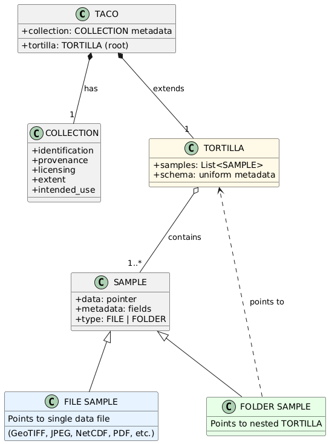
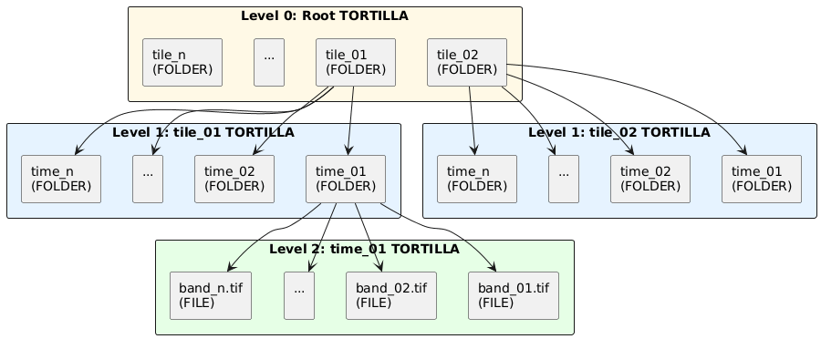

# The TACO specification 

## **1. Version and schema**

This is version 2.0.0 of the TACO specification, released on June 30, 2025. See [Version Compatibility](#3.-Version-Compatibility) for details on compatibility with previous versions.

## 2. Overview

The TACO (Transparent Access to Cloud-Optimized datasets) specification defines a comprehensive standard for organizing, storing, and accessing AI-ready Earth Observation (EO) datasets. TACO addresses the fragmentation in current EO dataset practices by providing:

1. A formal data model that defines the logical structure and relationships of hierarchical geospatial datasets.

2. A physical storage format optimized for cloud-native access with efficient metadata organization.

3. A standardized API for creating and reading TACO-compliant datasets across multiple programming languages.

TACO is built on widely-adopted open technologies (GDAL, Apache Parquet) to ensure broad compatibility and long-term maintainability. The specification is designed to support the full lifecycle of AI-ready EO datasets: from creation and distribution to efficient querying and streaming in cloud environments.

## 3. Design Goals

The TACO specification is guided by the following design principles:

1. Self-contained and portable: TACO files encapsulate all data and metadata required for interpretation without external dependencies. A TACO dataset can be copied, moved, or archived as a single unit.

2. Cloud-optimized: The format supports partial reads and efficient byte-range access, enabling streaming workflows without downloading entire datasets. Metadata is organized to minimize HTTP requests in cloud storage scenarios.

3. Hierarchical by design: TACO natively supports nested dataset structures through the Position-Isomorphic Tree (PIT) constraint, enabling efficient SQL queries over multi-level hierarchies.

4. FAIR-compliant: TACO implements the FAIR principles (Findability, Accessibility, Interoperability, Reusability) through standardized metadata, persistent identifiers, clear licensing, and format interoperability.

5. Language-agnostic: By relying on GDAL Virtual File System (VFS) and Apache Parquet, TACO can be implemented in any language with GDAL bindings (Python, R, Julia, C++, etc.).

6. Extensible: The specification defines core metadata fields while allowing domain-specific extensions through a formal extension mechanism.

## 4. Architecture Overview


The TACO specification is structured around three distinct but interconnected layers, each serving a specific purpose in the complete system design (Figure 1):

- Data Model Layer (Logical): Defines the abstract structure, relationships, and constraints that govern how datasets are organized. This layer specifies what constitutes a valid TACO dataset independently of how it is physically stored.

- Physical Layer (Storage): Defines the concrete serialization format, including byte layout, metadata encoding, and file organization. This layer implements the logical model using established technologies (Apache Parquet, GDAL-compatible formats).

- API Layer (Programmatic Access): Provides standardized methods for creating, validating, reading, and querying TACO datasets. This layer abstracts the complexity of the physical format, offering a consistent interface across programming languages.

This separation of concerns enables independent evolution of each layer while maintaining compatibility. For example, the physical layer can adopt new compression algorithms without affecting the data model, and multiple API implementations can coexist (Python, R, Julia, Matlab) as long as they provide the same core methods and functionalities, ensuring that users can switch between languages seamlessly.


<caption>
Figure 1: TACO Three-Layer Architecture. The specification separates logical structure (Data Model), concrete serialization (Physical), and programmatic access (API).
</caption>

# 5. PART I: DATA MODEL LAYER (Logical Structure)

## 5.1. Core Concepts

The TACO data model defines three fundamental abstractions that structure how datasets are organized: SAMPLE, TORTILLA, and TACO. These concepts form a nested hierarchy where each level serves a distinct purpose in representing AI-ready geospatial datasets.

### 5.2. SAMPLE

A SAMPLE represents the minimal self-contained and smallest indivisible unit. Each SAMPLE encapsulates both data and metadata, providing everything needed to interpret a single instance without external dependencies. Each SAMPLE maintains pointers to both its data and metadata. The metadata itself also contains fields that point to the data, enabling direct access to the underlying files. SAMPLEs are classified into two types based on their content:

**FILE**: The SAMPLE points to a single data file (e.g., GeoTIFF, JPEG, NetCDF, PDF).

**FOLDER**: The SAMPLE points to a TORTILLA container, enabling hierarchical structures.


### 5.2 TORTILLA

A TORTILLA is a collection of SAMPLEs. All SAMPLEs within a TORTILLA MUST have the same metadata schema with consistent types, ensuring that the combined metadata can be represented as a tabular dataframe. 

Because a SAMPLE can point to another TORTILLA (FOLDER type), hierarchical dataset structures can be created through recursive nesting. For example, a root TORTILLA contains SAMPLEs of spatial tiles (FOLDER type), where each tile is itself a TORTILLA containing temporal sequences (FOLDER type), and each sequence is a TORTILLA containing multi-band images (FILE type). This hierarchical organization enables efficient representation of complex geospatial datasets with multiple levels of grouping while maintaining a simple and consistent data model.

### 5.3 TACO

TACO extends TORTILLA by adding comprehensive dataset-level metadata in a structure called COLLECTION. This metadata provides semantic information about the dataset as a whole, such as identification, provenance, licensing, spatiotemporal coverage, and intended use. A TACO dataset MUST have exactly one root TORTILLA that contains all SAMPLEs.



<caption>
Figure 2: TACO Core Data Model. A SAMPLE is the minimal unit, classified as FILE (pointing to data files) or FOLDER (pointing to TORTILLAs). TORTILLA is a collection of SAMPLEs with uniform metadata schema. TACO extends TORTILLA by adding dataset-level COLLECTION metadata.
</caption>

### 5.4 Hierarchical Organization (PIT)

The Position-Isomorphic Tree (PIT) is a structural constraint that governs how hierarchical TACO datasets are organized. For a dataset to be PIT-compliant, the following rules MUST be enforced:

**Uniform SAMPLE count**: All TORTILLAs at the same hierarchy level MUST contain the same number of SAMPLEs.

**Identical SAMPLE identifiers**: SAMPLEs at the same position across all TORTILLAs in the same level MUST have identical identifiers.

**Consistent SAMPLE types**: SAMPLEs at the same position across all TORTILLAs in the same level MUST have the same type (FILE or FOLDER).

This constraint enables O(1) direct access instead of O(n) tree traversal by allowing queries to calculate exact positions using arithmetic rather than scanning metadata (Figure 3).



<caption>
Figure 3: Position-Isomorphic Tree (PIT) Constraint. A hierarchical dataset with three levels: spatial tiles (Level 0), temporal sequences (Level 1), and multi-band files (Level 2). PIT ensures all TORTILLAs at the same level contain identical structure: same number of SAMPLEs (n), same identifiers at each position, and same types (FOLDER or FILE). This uniformity enables O(1) direct access.
</caption>

**Padding for irregular structures**: When datasets have missing observations (e.g., due to cloud cover or sensor failures), placeholder SAMPLEs with identifiers `__TACOPAD__N` are inserted to maintain PIT compliance while preserving structural consistency.

**Example**: Consider the CloudSEN12 dataset with 10,000 FOLDER samples, each with tree 
files: Sentinel-2 L1C (s2_l1c.tif), Sentinel-2 L2A (s2_l2a.tif), and labels (target.tif). Under PIT, accessing data follows a standardized access pattern: `{s2_id}/s2_l1c.tif` for input imagery and `{s2_id}/target.tif` for labels, where `s2_id` is the SAMPLE identifier. File names or type within each folder SAMPLE cannot be modified, as this would break the PIT schema uniformity.

## 5.5 Metadata Schema

The TACO data model defines metadata at two levels: SAMPLE-level metadata describing individual units, and TACO-level metadata (COLLECTION) describing the dataset as a whole.

### 5.5.1 SAMPLE-level Fields

**Core fields (REQUIRED):**

- `id` (String): Unique identifier for the SAMPLE. MUST NOT contain slashes (`/`, `\`) or colons (`:`). MUST NOT start with double underscore (`__`), which is reserved for padding.
- `type` (String): SAMPLE type. MUST be either `FILE` or `FOLDER`.
- `path` (String | Null): Location of the data. For FILE samples, contains the file path. For FOLDER samples, contains a pointer to a TORTILLA.

**Extension fields:**

SAMPLEs can be extended with domain-specific metadata through the extension mechanism. Extensions add additional fields using namespace prefixes (e.g., `stac:*`, `rai:*`, `stats:*`). All SAMPLEs within a TORTILLA MUST have identical metadata schemas, including all extension fields.

TORTILLA provides an efficient mechanism for computing extension metadata over sets of SAMPLEs. When metadata computation benefits from accessing the entire dataset (e.g., statistical aggregations, spatial indexing, batch processing), TORTILLA extensions compute fields across all contained SAMPLEs simultaneously rather than individually.

### 5.5.2 TACO-level Fields (COLLECTION)

**Core fields (REQUIRED):**

- `id` (String): Unique persistent identifier for the dataset. MUST be lowercase alphanumeric with underscores and hyphens allowed.
- `taco_version` (String): TACO specification version (e.g., "0.5.0").
- `dataset_version` (String): Version of the dataset itself.
- `description` (String): Human-readable description of the dataset.
- `licenses` (List[String]): Dataset license(s). SPDX identifiers are RECOMMENDED.
- `providers` (List[Object]): Persons or organizations who created the dataset. Each object contains `name`, `organization`, `email`, and `role` fields.
- `tasks` (List[String]): Machine learning tasks the dataset supports (e.g., `["semantic-segmentation"]`, `["classification"]`).

**Optional fields:**

- `title` (String): Short title for the dataset (max 250 characters).
- `curators` (List[Object]): Persons responsible for converting the dataset to TACO format. Same structure as `providers`.
- `keywords` (List[String]): Descriptive keywords for searchability.
- `extent` (Object): Spatial and temporal coverage. Contains `spatial` (bounding box `[min_lon, min_lat, max_lon, max_lat]` in WGS84) and `temporal` (ISO 8601 datetime strings `[start, end]`).

**Extension fields:**

TACO-level extensions add dataset-wide metadata using the same namespace convention as SAMPLE-level extensions.


<caption>
Figure 4: TACO Metadata Schema Overview. SAMPLE metadata consists of core fields (id, type, path) and extension fields using namespace prefixes. TORTILLA provides efficient computation of extensions over collections of SAMPLEs. TACO metadata (COLLECTION) includes core fields for dataset identification, optional fields for additional context, and extension fields for domain-specific metadata. All levels use the same namespace-based extension mechanism.
</caption>

# 6. PART II: PHYSICAL LAYER (Serialization)

## 6.1 Directory Structure

TACO datasets follow a standardized directory structure consisting of three main components:

**DATA/**: Contains the hierarchical organization of data files and folders. Each SAMPLE of type FILE is stored as a physical file, while each SAMPLE of type FOLDER is represented as a subdirectory containing its own set of SAMPLEs. This structure mirrors the logical hierarchy defined in the data model.

**METADATA/**: Contains consolidated metadata for efficient querying across the entire dataset. Metadata is organized into separate files per hierarchy level: `level0.parquet`, `level1.parquet`, etc. Each file contains the complete metadata for all SAMPLEs at that specific depth in the hierarchy.

**COLLECTION.json**: This file contains the dataset-level metadata as a UTF-8 encoded JSON document. It includes all core and optional fields defined in the TACO metadata schema, as well as any TACO-level extensions.

**Example 1 - Flat structure (single level):**

```
dataset/
├── DATA/
│   ├── image_001.tif
│   ├── image_002.tif
│   └── image_003.tif
├── METADATA/
│   └── level0.parquet
└── COLLECTION.json
```

**Example 2 - Two-level hierarchy (spatial tiles → temporal images):**

```
dataset/
├── DATA/
│   ├── tile_001/
│   │   ├── __meta__
│   │   ├── 2023-01-01.tif
│   │   ├── 2023-01-02.tif
│   │   └── 2023-01-03.tif
│   ├── tile_002/
│   │   ├── __meta__
│   │   ├── 2023-01-01.tif
│   │   ├── 2023-01-02.tif
│   │   └── 2023-01-03.tif
│   └── tile_003/
│       ├── __meta__
│       ├── 2023-01-01.tif
│       ├── 2023-01-02.tif
│       └── 2023-01-03.tif
├── METADATA/
│   ├── level0.parquet
│   └── level1.parquet
└── COLLECTION.json
```

**Example 3 - Three-level hierarchy (scenes → components → bands):**

```
dataset/
├── DATA/
│   ├── scene_001/
│   │   ├── __meta__
│   │   ├── label.json
│   │   └── imagery/
│   │       ├── __meta__
│   │       ├── before.tif
│   │       └── after.tif
│   ├── scene_002/
│   │   ├── __meta__
│   │   ├── label.json
│   │   └── imagery/
│   │       ├── __meta__
│   │       ├── before.tif
│   │       └── after.tif
├── METADATA/
│   ├── level0.parquet
│   ├── level1.parquet
│   └── level2.parquet
└── COLLECTION.json
```

**Invalid structure (PIT violation - mixed types at same level):**

```
dataset/
├── DATA/
│   ├── tile_001/          ← FOLDER
│   │   └── __meta__
│   ├── tile_002/          ← FOLDER
│   │   └── __meta__
│   └── image_003.tif      ← FILE (BREAKS PIT!)
├── METADATA/
│   └── level0.parquet
└── COLLECTION.json
```

This violates PIT because level 0 contains both FOLDER samples (tile_001, tile_002) and FILE samples (image_003.tif). All samples at the same level MUST have the same type.

### 6.2 Dual Metadata System

TACO implements a dual metadata strategy to optimize for different access patterns:

**Consolidated Metadata (METADATA/levelX.parquet)**

Purpose: Enable efficient SQL queries across the entire dataset without traversing the directory hierarchy.

Content: Contains all SAMPLE metadata at each hierarchy level, including core fields (id, type, path), extension fields, and the automatically generated `internal:parent_id` field that links each SAMPLE to its parent's index in the previous level.

Access pattern: Loaded once at dataset initialization for query planning and execution. Enables operations like filtering by spatiotemporal extent, aggregating statistics, or selecting specific SAMPLEs without filesystem traversal.

**Local Metadata (DATA/folder/__meta__.parquet)**

Purpose: Enable fast navigation within a specific folder without loading the entire dataset's metadata.

Content: Contains metadata only for the direct children of a specific folder. Each `__meta__` parquet file represents a complete metadata snapshot for one TORTILLA container.

Access pattern: Read on-demand when navigating into a specific folder or querying a subset of the hierarchy. Enables efficient local operations without the overhead of loading global metadata.

The dual system allows TACO readers to choose the optimal metadata source based on the query: consolidated metadata for global operations, local metadata for hierarchical navigation.

### 6.3 ZIP Format

TACO implements a cloud-optimized version of the ZIP format. The standard ZIP format requires scanning the Central Directory located at the end of the file to access internal files. TACO ZIP solves this by including a TACO_HEADER at byte position 0 that contains direct offsets to all metadata files and `COLLECTION.json`, enabling immediate access without Central Directory traversal.

All files in TACO ZIP archives use STORE mode (compression method = 0), meaning no compression is applied. This design choice enables efficient byte-range access in cloud storage scenarios, GDAL Virtual File System compatibility, and parallel random access patterns without decompression overhead.

When a ZIP container is created, two additional metadata columns are generated: `internal:offset` indicating the byte offset of each SAMPLE within the ZIP file, and `internal:size` indicating the length in bytes. These columns enable direct access to individual SAMPLEs without decompressing the entire archive. The ZIP format is immutable once created and is suitable for distribution, archival, and cloud storage deployments.

### 6.4 FOLDER Format

The FOLDER format stores TACO datasets as a directory structure. Files remain directly accessible for inspection and modification without requiring extraction or decompression. This format is suitable for development environments and datasets requiring frequent updates.

FOLDER format supports efficient metadata updates through Content-Defined Chunking (CDC). CDC divides parquet files into variable-sized chunks based on content rather than fixed positions, typically using algorithms such as FastCDC/Rabin–Karp with average chunk sizes around 64KB. The storage backend maintains a content-addressed store where each chunk is identified by its cryptographic hash, enabling automatic deduplication of identical chunks across versions.

When metadata is updated, only chunks containing modified data need to be transferred to storage. The storage backend reconstructs files by assembling the appropriate chunks based on their hash references. This approach reduces transfer size proportionally to the magnitude of changes rather than total file size, providing significant efficiency improvements for incremental updates to large Parquet metadata files.

Server support for content-defined chunking and chunk-level deduplication is required to achieve these performance characteristics.


### 6.5 TacoCat Format

TacoCat is a consolidated format that addresses the operational challenges of managing large collections of individual TACO ZIP files. When datasets are distributed as hundreds or thousands of separate ZIP containers, querying across the collection requires opening each file individually to access its metadata. TacoCat solves this by consolidating all metadata from multiple ZIP files into a single high-performance container.

The format extracts and merges all METADATA/levelX.parquet files from source ZIP containers into consolidated Parquet files, one per hierarchy level. An additional column `internal:source_file` is added to track the original ZIP filename for each sample. This enables queries across the entire collection using a single DuckDB connection without filesystem traversal or individual ZIP file access.

TacoCat uses a fixed 128-byte binary header containing the format magic number, version identifier, maximum hierarchy depth, and a 7-entry index table. The index stores byte offsets and sizes for up to 6 consolidated metadata levels plus the merged `COLLECTION.json`. Data sections begin at byte 128 and are stored sequentially. The consolidated `COLLECTION.json` preserves the PIT schema from source datasets and includes provenance metadata listing all source ZIP filenames.

When reading samples, the GDAL VSI path is constructed as `/vsisubfile/{offset}_{size},{base_path}{source_file}` where offset and size reference the original position within the source ZIP file identified by source_file. This allows direct byte-range access to data without extracting or opening intermediate containers.


# 7. PART III: API LAYER (Programmatic Access)

## 7.1. TacoToolbox (Writer API)

TacoToolbox provides functionality for creating, converting, and validating TACO datasets. The API is organized around three core concepts: Sample (minimal unit), Tortilla (collection), and Taco (complete dataset).

### **7.1.1. Data Model Classes**

**`datamodel.Sample`**

Represents the minimal self-contained unit in a TACO dataset. Each Sample encapsulates data and metadata.

```python
Sample(
    id: str,                    # Unique identifier
    type: "FILE" | "FOLDER" | "auto",  # Type inference by default
    path: Path | bytes | Tortilla,
    temp_dir: Path = None,      # For bytes conversion
    **metadata                  # Extension fields
)
```

**Type Inference**: When `type="auto"` (default), type is automatically inferred from path. Path or bytes become FILE, Tortilla becomes FOLDER. After validation, type is always FILE or FOLDER.

**Bytes Support**: When passing bytes as path, temporary files are created automatically. Use `temp_dir` parameter to specify location for large datasets. Files are cleaned up on garbage collection or explicit `cleanup()` call.

**`datamodel.Tortilla`**

Collection of Samples with uniform metadata schema. Validates Position-Isomorphic Tree constraints.

```python
Tortilla(
    samples: list[Sample],
    pad_to: int = None,         # Auto-pad to divisible length
    strict_schema: bool = True  # Enforce schema uniformity
)
```

**Auto-Padding**: The `pad_to` parameter automatically adds padding samples to make total length divisible by specified value. Padding samples use ID prefix `__TACOPAD__` with empty bytes creating zero-byte temporary files.

**Schema Modes**: With `strict_schema=True`, all samples must have identical metadata schemas. With `strict_schema=False`, heterogeneous schemas are allowed with automatic None-filling for missing columns.

**`datamodel.Taco`**

Complete dataset extending Tortilla with collection-level metadata.

```python
Taco(
    tortilla: Tortilla,
    id: str,
    dataset_version: str,
    description: str,
    licenses: list[str],
    providers: list[Contact],
    tasks: list[TaskType],
    taco_version: str = "0.5.0",
    title: str = None,          # Max 250 characters
    curators: list[Contact] = None,
    keywords: list[str] = None,
    extent: Extent = None       # Auto-calculated from STAC/ISTAC
)
```

**Extent Auto-Calculation**: If extent is not provided, Taco searches incrementally through hierarchy levels for [STAC]() or [ISTAC]() metadata and computes spatial and temporal extents automatically. Defaults to global extent if no spatiotemporal metadata found.

### **7.2 Extension System**

The extension system enables adding computed or declarative metadata to Samples, Tortillas, and Tacos through a unified `extend_with()` interface.

**Sample Extensions**

Sample extensions add metadata fields computed from the sample's data. Extensions can be computational (implementing `SampleExtension` abstract class) or declarative (dict, DataFrame, Pydantic model).

```python
class SampleExtension(ABC):
    schema_only: bool = False  # Return None values preserving schema
    
    @abstractmethod
    def get_schema(self) -> dict[str, pl.DataType]:
        """Return expected DataFrame schema."""
        
    @abstractmethod
    def _compute(self, sample: Sample) -> pl.DataFrame:
        """Compute metadata, return single-row DataFrame."""
```

The `schema_only` parameter enables schema-first workflows where structure is defined without computation cost. When `True`, `_compute()` is never called and None values are returned with proper schema.

Extension fields are added directly to the Sample model and tracked in `_extension_schemas` for proper DataFrame serialization. Key validation ensures extension fields use valid formats: alphanumeric plus underscore, optionally with colon for namespaces.

**Tortilla Extensions**

Tortilla extensions add columns to the metadata DataFrame computed across all samples in the collection.

```python
class TortillaExtension(ABC):
    schema_only: bool = False
    
    @abstractmethod
    def get_schema(self) -> dict[str, pl.DataType]:
        """Return expected schema."""
        
    @abstractmethod
    def _compute(self, tortilla: Tortilla) -> pl.DataFrame:
        """Compute metadata, return DataFrame with one row per sample."""
```

The returned DataFrame must have exactly one row per sample. Column conflicts with existing metadata are rejected. Extensions are applied via horizontal concatenation using DataFrame `hstack` operation.

**Taco Extensions**

Taco extensions add dataset-level computed metadata.

```python
class TacoExtension(ABC):
    @abstractmethod
    def get_schema(self) -> dict[str, pl.DataType]:
        """Return schema."""
        
    @abstractmethod
    def _compute(self, taco: Taco) -> pl.DataFrame:
        """Compute metadata, return single-row DataFrame."""
```

Extension data is added as instance attributes directly to the Taco object. Supports Contact and Extent structured types with automatic serialization.

### **7.3. Core Functions**

**`create(taco, output_path, mode="zip"|"folder", **kwargs)`**

Primary function for writing TACO datasets to disk. Supports both ZIP and FOLDER container formats with format-specific parameters passed through kwargs.

**`create_tacocat(tacozips, output_dir, **parquet_kwargs)`**

Consolidates multiple ZIP containers into single high-performance file. Merges all metadata into consolidated Parquet files with `internal:source_file` column tracking origin. Validates schema consistency across datasets. Generates fixed-name `__TACOCAT__` file with 128-byte binary header containing format magic, version, maximum depth, and 7-entry index table.

**`create_tacollection(tacozips, output_dir, validate_schema=True)`**

Creates global TACOLLECTION.json from multiple datasets. Validates PIT schema structure and field schema consistency across all inputs. Sums sample counts in `taco:pit_schema` hierarchy, computing total dataset size. Merges spatial extents into global bounding box covering all partitions, and merges temporal extents into global time range spanning earliest start to latest end. Preserves individual partition extents in `taco:sources` field for query routing and visualization. Uses first dataset as base for other metadata fields. Always generates standard-named `TACOLLECTION.json` file in output directory.

**`export(dataset, output_path, mode="folder", **kwargs)`**

Exports filtered subsets of existing TACO datasets. Preserves hierarchical structure while updating collection metadata with subset provenance tracking via `taco:subset_of` and `taco:subset_date` fields.

### **7.4 Format Conversion**

**`folder2zip(folder_path, zip_output, temp_dir=None, **kwargs)`**

Converts FOLDER format to ZIP format. Reads existing metadata from FOLDER structure including COLLECTION.json and consolidated metadata. Reconstructs local metadata from consolidated metadata for `__meta__` file generation. Scans DATA directory for physical files. Uses ZipWriter to create ZIP container with bottom-up offset calculation, regenerating all `__meta__` files with `internal:offset` and `internal:size` columns.

**`zip2folder(zip_path, folder_output, quiet=False)`**

Converts ZIP format to FOLDER format. Uses ExportWriter wrapper providing progress bars unless quiet mode enabled.

### **7.5 Logging Control**

**`verbose(level=True|"debug"|False)`**

Controls logging verbosity across all TacoToolbox operations. Level `True` or `"info"` shows standard progress including file counts and operations. Level `"debug"` shows detailed internal operations including offset calculations and metadata processing. Level `False` disables all logging output. Settings apply globally to all subsequent operations until changed.


<caption>
Overview of TacoToolbox writer API
</caption>

## **8. TacoReader (Reader API)**

TacoReader provides functionality for loading and querying TACO datasets through a lazy SQL interface built on DuckDB. The API is organized around three core concepts: TacoDataset (lazy query interface), TacoDataFrame (materialized results with navigation), and PITSchema (structural validation).

### **8.1 Loading Datasets**

**`load(path, base_path=None)`**

Main entry point for loading TACO datasets with automatic format detection. Supports single paths or lists with automatic concatenation if schemas are compatible.

```python
load(
    path: str | list[str],  # Single path or list for auto-concat
    base_path: str = None   # TacoCat only: override ZIP locations
)
```

**Format Detection**: Automatically detects format from path structure. TacoCat identified by fixed filename `__TACOCAT__`. ZIP identified by `.tacozip` or `.zip` extensions. FOLDER identified by directory structure (default when no extension match).

**List Handling**: When provided a list of paths, loads each dataset and automatically concatenates if schemas are compatible. Empty lists raise ValueError. Single-element lists unwrapped to simple load operation.

**TacoCat Base Path Override**: The `base_path` parameter enables loading TacoCat index files separate from source ZIP files. When specified, reconstructs all DuckDB views using new base path for `/vsisubfile/` VSI path construction. Useful for distributed storage where metadata index and data files reside in different locations.


### **8.2 TacoDataset - Lazy Query Interface**

TacoDataset provides STAC-like metadata container with DuckDB connection enabling lazy SQL queries. All operations create views without materializing data until `.data` property accessed.

**Public Metadata (STAC-like):**

- `id`, `version`, `description`: Dataset identification
- `tasks`, `extent`, `providers`, `licenses`: Dataset characteristics  
- `title`, `curators`, `keywords`: Optional descriptive metadata
- `pit_schema`: Position-Isomorphic Tree structural schema
- `field_schema`: Column schemas by hierarchy level
- `collection`: Complete COLLECTION.json content

**Properties**

`data` property materializes current view to TacoDataFrame executing DuckDB query and loading results into memory. This is where lazy evaluation ends and data becomes available for operations.

`field_schema` property returns column schema dictionary from `taco:field_schema` in collection metadata showing available columns and types per hierarchy level.

`collection` property returns complete COLLECTION.json content with all metadata as dictionary. Returns copy to prevent accidental modification of internal state.

**SQL Interface**

`sql(query)` method executes SQL query creating new TacoDataset with lazy view. Query not executed immediately, only view created. Always use `data` as table name which auto-replaces with current view name enabling query chaining. Tracks JOINs with level1+ tables for export validation. Updates PIT schema with new row count after filtering.

Query chaining example:

```python
ds1 = dataset.sql("SELECT * FROM data WHERE cloud_cover < 10")
ds2 = ds1.sql("SELECT * FROM data WHERE country = 'Peru'")  
result = ds2.data  # Executes combined query
```

**STAC-Style Filtering**

`filter_bbox(minx, miny, maxx, maxy, geometry_col="auto", level=0)` filters by spatial bounding box using DuckDB Spatial extension. When `geometry_col="auto"`, searches columns in priority order: `istac:geometry`, `stac:centroid`, `istac:centroid`. When `level > 0`, filters level0 samples based on children's geometry using cascading JOINs.

`filter_datetime(datetime_range, time_col="auto", level=0)` filters by temporal range using native Parquet TIMESTAMP columns. Accepts string range `"2023-01-01/2023-12-31"`, single datetime object, or tuple of datetime objects. When `time_col="auto"`, searches columns in priority order: `istac:time_start`, `stac:time_start`. Always uses `time_start` not `time_middle` or `time_end`. When `level > 0`, filters level0 samples based on children's timestamps.

**Cascading Joins**: Multi-level filtering uses INNER JOINs: `level0 -> level1 -> level2 -> target_level` using `internal:parent_id` foreign keys. Returns DISTINCT level0 samples whose descendants match filter criteria. JOIN strategy varies by format: ZIP/FOLDER use parent_id referencing parent's ID string, TacoCat uses parent_id as local index plus `internal:source_file` for disambiguation across multiple source ZIPs.

### **8.3 TacoDataFrame - Hierarchical Navigation**

TacoDataFrame wraps DataFrame with TACO-specific functionality for hierarchical navigation and statistics aggregation. Provides read() for traversing nested structures and stats_*() methods for aggregating pre-computed metadata.

**Protected Columns**: Critical columns cannot be modified without breaking navigation functionality. Core columns `id`, `type` required for sample identification. All `internal:*` columns required for hierarchical traversal and GDAL access including `internal:parent_id`, `internal:offset`, `internal:size`, `internal:gdal_vsi`, `internal:source_file`, `internal:relative_path`. Operations that remove these columns raise ValueError with guidance.

**DataFrame Operations**

Standard operations return new TacoDataFrame instances preserving navigation capability: `filter()` using expressions, `select()` for column projection, `limit()` for row count restriction, `sort()` by column values, `with_column()` for adding derived columns immutably.

Column modification supports both pandas-style in-place `tdf["new_col"] = values` and Polars-style immutable `tdf.with_column("new_col", expr)`. Protected columns rejected in both modes. Validation ensures navigation columns remain present after operations.

**Hierarchical Navigation**

`read(key)` method navigates to child level by position (int) or ID (str). FILE samples return GDAL VSI path as string enabling direct raster access. FOLDER samples read `__meta__` file and return TacoDataFrame with children.

Path construction varies by format:

- **ZIP/TacoCat**: `/vsisubfile/{offset}_{size},{zip_path}` enables GDAL byte-range access without extraction

- **FOLDER**: Direct filesystem paths `{parent_path}/{relative_path}` or `{parent_path}/{id}`

Navigation example:

```python
tdf = dataset.data
child = tdf.read(0)          # By position
child = tdf.read("sample_01") # By ID  
vsi_path = tdf.read(5)       # Returns str if FILE
```

**Statistics Aggregation**

Pre-computed statistics stored in `internal:stats` column aggregated using weighted averaging based on `stac:tensor_shape`. Statistics format auto-detected: continuous stats have 9 values `[min, max, mean, std, valid%, p25, p50, p75, p95]`, categorical stats have N values `[prob_class_0, ..., prob_class_N]`.

Aggregation methods:
- `stats_mean()`: Weighted average of means
- `stats_std()`: Pooled standard deviation formula
- `stats_min()`, `stats_max()`: Global extrema across all rows
- `stats_categorical()`: Weighted average of class probabilities
- `stats_p25()`, `stats_p50()`, `stats_p75()`, `stats_p95()`: Percentile approximations using simple averaging (not statistically exact)

### **8.4 Concatenation**

**`concat(datasets, column_mode="intersection")`**

Concatenates multiple TacoDataset instances into single dataset with lazy SQL using UNION ALL views in DuckDB. Creates in-memory database with consolidated metadata. No temp files or disk materialization.

**Column Modes**:

`intersection` mode (default, safest) keeps only columns present in ALL datasets. Drops columns existing only in some datasets with warning showing which columns dropped and from which datasets. Suitable when datasets have slight schema variations and only common columns needed.

`fill_missing` mode keeps all columns from all datasets, filling missing columns with NULL. Warns showing which columns being filled and in which datasets. Suitable when all columns needed even if some datasets lack them.

`strict` mode fails if columns differ between datasets. Raises ValueError with detailed breakdown showing exact schema per dataset, columns only in some datasets, and columns common to all. Suitable for production pipelines requiring schema homogeneity.

**Validation**: Validates PIT schemas structurally identical (ignoring `n` values). Validates critical columns present in all datasets: `id`, `type`, `internal:gdal_vsi`, `internal:parent_id`, `internal:offset`, `internal:size`. Missing critical columns raise ValueError as they break hierarchical navigation.

**View Construction**: Creates intermediate `level*_union` views with UNION ALL of all datasets, then final `level*` views with `internal:gdal_vsi` column constructed per format. Adds `internal:source_file` column tracking origin dataset. Filters padding samples from user-facing views.

### **8.5 Backend System**

Three backends handle format-specific loading strategies sharing common interface through `TacoBackend` abstract base class.

**ZipBackend** reads `.tacozip` format using TACO_HEADER at file start for direct offset-based access without full ZIP extraction. Groups consecutive files within 4MB gaps to minimize HTTP requests for remote files. Constructs VSI paths as `/vsisubfile/{offset}_{size},{zip_path}` enabling GDAL byte-range access.

**FolderBackend** reads directory structure with loose files. Local loading uses lazy disk access without memory loading. Remote loading downloads all metadata to memory. Level 0 constructs paths as `{root}DATA/{id}`, level 1+ uses `{root}DATA/{internal:relative_path}`. FOLDER samples append `/__meta__` for metadata access.

**TacoCatBackend** reads consolidated format from multiple source ZIPs. Parses fixed 128-byte binary header containing format magic, version, max depth, and 7-entry index table. Loads entire file to memory (typically <1GB metadata-only). Constructs VSI paths as `/vsisubfile/{offset}_{size},{base_path}{source_file}` where `source_file` column identifies origin ZIP. Enables querying terabytes of data without opening each ZIP individually.

### **8.6 Logging Control**

**`verbose(level=True|"debug"|False)`**

Controls logging verbosity across all TacoReader operations. Level `True` or `"info"` shows standard progress, including file loading, backend operations, and view creation. Level `"debug"` shows detailed internal operations including DuckDB queries, offset calculations, and memory operations. Level `False` disables all logging output. Settings apply globally to all subsequent operations until changed.


<caption>
Overview of TacoReader writer API
</caption>
